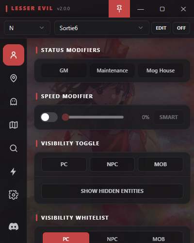

# LesserEvil

  
  
  

  
   
  <em>Example of the main LesserEvil UI.</em>

LesserEvil is a modernized version of the early Project-Tako with several
functionality updates, a reworked UI built on WebView2 + React, and quality-of-life
features aimed at multiboxers — warp-all, per-zone profiles, entity scanning/tracking,
updated maps (Sortie, Odyssey, and more), and tighter integration between features.

## Support

Need help getting set up, run into a problem, or want the latest updates? **[Join the LesserEvil/Forest Discord](https://discord.gg/vSgYvdh8gT)**.

## Features

- **Multibox Warp-All** — Warp every same-zone attached character to a saved point, a teammate, or your current target in one click.
- **Per-Zone Profiles** — Define settings per zone (Sortie, Odyssey, etc.) that auto-apply when any attached character enters the zone, regardless of which character LE is focused on.
- **Per-Character Visibility Toggles** — Hide PC/NPC/MOB, per-type whitelist/blacklist, and a Show Hidden Entities toggle that reveals server-flagged hidden mobs.
- **Map Overlay** — Live entity dots, click-to-warp, widescan rings, saved warp points, optional high-res 2048×2048 map pack.
- **Zone Scan + Tracking** — Resolve any in-zone entity's coords via the companion Windower addon, warp to it, or pin it for live tracking.
- **Themeable UI** — Built-in Gnosis, LesserEvil, Dawn, and Minimalist themes with persistent per-character display preferences.
- **And more...** — Speed modifier (with Smart Speed auto-disable around untrusted players), warp guard, hotkey-bound saved actions, action aliases over the Windower console, and per-character compact / regular / large window presets.

## Documentation

Full documentation can be found on the docs site:

**https://suspiciousman3187.github.io/LesserEvil/**

## Download & Install

Grab the latest build from the
[**Releases**](https://github.com/suspiciousman3187/LesserEvil/releases/latest)
page. Three assets are provided:

- **`LesserEvil-Desktop`** — the desktop application. Extract anywhere and run
  `LesserEvil.exe`. User settings/config are created automatically on first
  launch.
- **`LesserEvil-Addon`** — optional companion Windower addon. Extract the
  `LesserEvil` folder into your `Windower/addons/` directory. Only needed for
  the Scan/Track/Widescan features.
- **`LesserEvil-Maps-HighRes`** *(optional)* — 2048×2048 PNG map upgrade pack
  covering both LesserEvil's instanced/special zones and most standard
  outdoor / town zones (community Remapster pack integrated). Overlay it on
  top of the desktop install for sharper maps.

## Requirements

- Windows 10 / 11
- Final Fantasy XI installed (any region)
- .NET Framework 4.6.2 runtime
- WebView2 runtime (pre-installed on modern Windows; auto-installs if missing)
- *(Optional)* [Windower 4](https://www.windower.net/) with the LesserEvil
  addon loaded — required only for Scan/Track/Widescan

## Known Bugs

This application is experimental and there may be bugs. Please use at your
own risk. Feel free to contact me on Discord if you find any.
